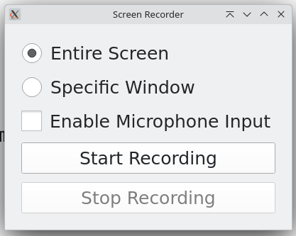

# The App

The app is an _extremely_ simple, optionless, lightweight screen recording tool.

This was born out of my frustration with the rather heavy-weight tools that existed.



# Future Roadmap

* Webcam integration

* Better window selection

* Area of screen selection

* Screen effects like blur, marking up, etc

# Running locally

```bash

python3 main.py
```

# Contributing

PRs are always welcome! Please make sure to run `autopep8` on the most aggressive setting.
